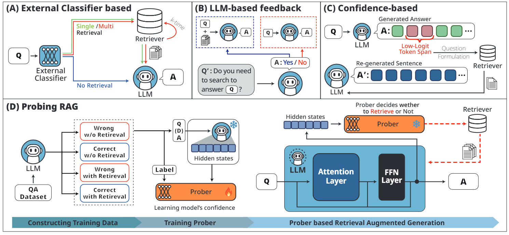

# Probing-RAG: Self-Probing to Guide Language Models in Selective Document Retrieval

Official Code Repository for the paper ["Probing-RAG: Self-Probing to Guide Language Models in Selective Document Retrieval"](https://arxiv.org/abs/2410.13339)

## Abstract
<div align="center">
  
</div>

Retrieval-Augmented Generation (RAG) enhances language models by retrieving and incorporating relevant external knowledge. However, traditional retrieve-and-generate processes may not be optimized for real-world scenarios, where queries might require multiple retrieval steps or none at all. In this paper, we propose a Probing-RAG, which utilizes the hidden state representations from the intermediate layers of language models to adaptively determine the necessity of additional retrievals for a given query. By employing a pre-trained prober, Probing-RAG effectively captures the model's internal cognition, enabling reliable decision-making about retrieving external documents. Experimental results across five open-domain QA datasets demonstrate that Probing-RAG outperforms previous methods while reducing the number of redundant retrieval steps.

## This code is being modified

## Installation
```bash
conda create -n probing python=3.10
conda activate probing

pip install git+https://github.com/jbloomAus/SAELens
pip install torch
pip install einops
pip install datasets
pip install tqdm
pip install wandb
pip install faiss-cpu
pip install ir-datasets
pip install -U sentence-transformers
pip install nltk
pip install llama-index
pip install ftfy
pip install llama-index-retrievers-bm25
pip install base58
pip install spacy

python -m spacy download en_core_web_sm
```
## Datasets
You can download datasets as follows:
```bash
bash download/download.sh
bash download/raw_data.sh
```

## Building a Prober Training Dataset

To train the prober, we need to create a dataset using the single-step retrieval method and the no-retrieval method. The code for creating this dataset is provided below.
```bash
bash make_dataset.sh
bash make_dataset_dev.sh
```

## Prober Training
You can train the prober using the created dataset. Adjust the ratio of correct to incorrect samples in the training dataset to 0.5, and then execute the code below.

```bash
bash train_prober.sh
```

## Evaluation
Finally, you are able to evaluate the QA performance of our Probing-RAG with the following code! 
```bash
bash rag.sh
```

## Citation
```BibTex
@article{baek2024probing,
  title={Probing-RAG: Self-Probing to Guide Language Models in Selective Document Retrieval},
  author={Baek, Ingeol and Chang, Hwan and Kim, Byeongjeong and Lee, Jimin and Lee, Hwanhee},
  journal={arXiv preprint arXiv:2410.13339},
  year={2024}
}
```
